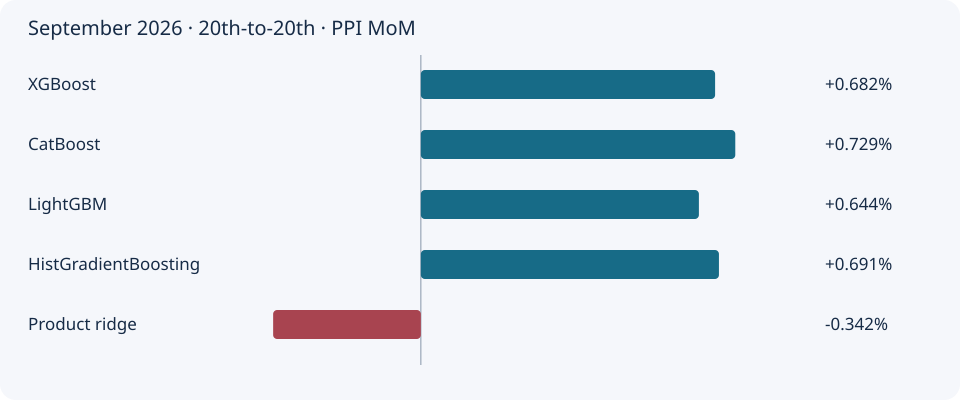

# China PPI dashboard

[Project home](../README.md) · [Model details](../docs/METHODOLOGY.md) · [English product glossary](../docs/PRODUCTS.md)

## Current update: October 2026

⏳ **Awaiting the current month’s price releases. No current-month projection has been generated.**

Report refreshed: 2026-10-06. Saved forecast timestamps are preserved.

## Latest available forecasts: September 2026

**20th-to-20th · 5 product-price estimators · Median +0.682% MoM**

4 of 5 displayed models project an increase; 1 project a decline. The estimates span **-0.342% to +0.729%**. The median describes this model group; it is not a selected ensemble or a confidence interval.

**How to read this:** +0.7% means prices are projected to be 0.7% higher than the previous month. These forecasts concern headline PPI month-on-month change, not year-on-year inflation.

**Price dates:** Current month 11–20 average prices compared with the previous month’s 11–20 averages. These are period averages, not point prices observed exactly on the 20th.

## Robustness check

Ridge changes by **1.156 percentage points** between the all-product and stable-product 20th-to-20th panels. Do not treat its sign as robust. Several live product changes exceed their fitted historical ranges.

[Read the forecast sense check, recent errors and all retained model estimates](forecast_quality.md)

Booster agreement is narrower than historical forecast errors; it is not a prediction interval. Sector-first and hybrid comparisons remain visible in the quality report.

## What each model does

| Active product model | Mechanism |
|---|---|
| XGBoost | Shallow boosted trees learn nonlinear relationships between individual product-price changes and headline PPI. |
| CatBoost | Regularized boosted trees provide an independent nonlinear estimate and handle structural missing prices. |
| LightGBM | A strongly constrained tree booster tests an alternative way of learning product-price interactions. |
| HistGradientBoosting | Histogram-based gradient boosting provides a simpler tree-booster benchmark with native missing-value handling. |
| Product ridge | Regularized linear regression tests whether a weighted combination of individual price changes is sufficient. Imputation and scaling are fitted on training data. |

## Other retained comparisons

Random forest, sector-first regression and the economic / ML hybrid remain available in the detailed view. Stable-product panels test basket sensitivity. The direct market-price tracker is shown separately as an uncalibrated price index. Category-factor models are retired.

## Explore

- **[Interactive dashboard file](dashboard.html)** — download the file and open it in a browser; choose month, timing, product panel and retained comparison models. It works without a login or external scripts.
- [All current model estimates and release availability](product_latest.md)
- [Product and sector attributions in English](attributions.md)
- [Historical accuracy](product_candidates.md) · [Prospective performance](product_performance.md)
- [Source and pipeline status](latest.md)
- [Frozen August forecast archive](august_2026_frozen.md)

Historical accuracy is pseudo-real-time. Keep accumulating prospective outcomes before ranking models. Product attributions explain the model output, not causal economic contributions.
